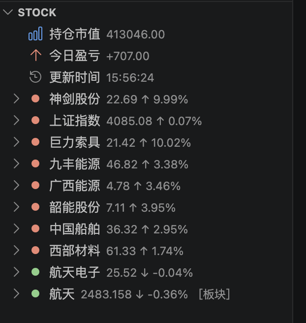
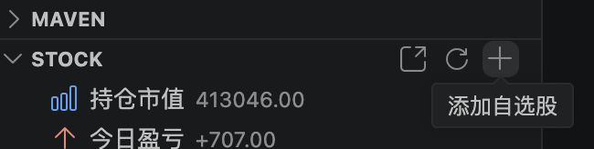
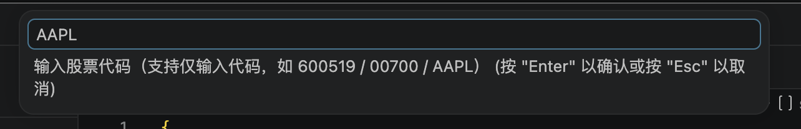
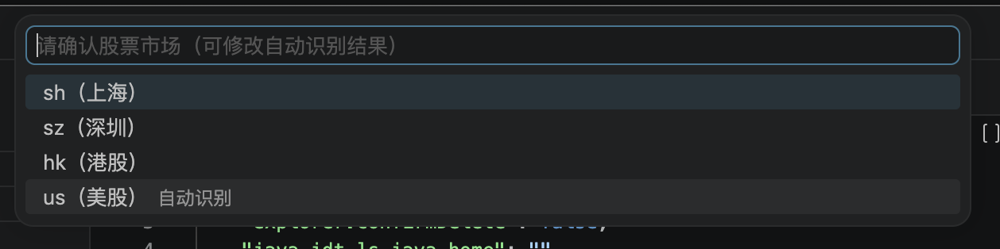
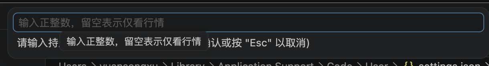
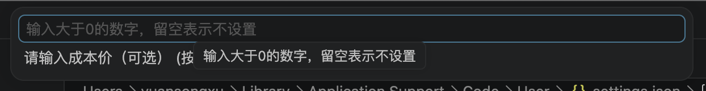

# 股票看盘工具 Stock Investment Pro

> 此项目Fork from [coderwang/stock-investment](https://github.com/coderwang/stock-investment)

> 感谢原作者：[@coderwang](https://github.com/coderwang)

## 效果展示

在侧边栏中展示自选股涨跌情况，每隔3秒自动刷新，示例如下：



---

## 使用方式

### 快捷方式：

点击标签栏右侧加号进行新增自选股票，支持A股，美股，板块

输入股票代码

自动识别股票市场

[可选] 输入持仓数（股）

[可选] 输入持仓成本


## 手动配置

在`VS Code Settings`中配置自选股代码，示例如下：

```
"stockInvestment.stockCodeList": [
        {
            "type": "stock",    //类型 stock股票/sector板块
            "market": "sh",     //股票市场"sz" | "sh" | "hk" | "us";
            "code": "00001",    //股票代码
            "order": 0,         //序号
            "shares": 200,      //持股数（股）
            "costPrice": 20     //成本价
        },
        {
            "type": "sector",
            "code": "886078",
            "name": "商业航天",
            "order": 1
        },
        {
            "type": "stock",
            "market": "us",
            "code": "AAPL",
            "order": 3
        }
    ]
```

---

## Todo

1. 支持配置自定义股票名称
2. 股票异动在标签栏提醒
3. 期货类型支持
4. 支持配置标签栏名称
